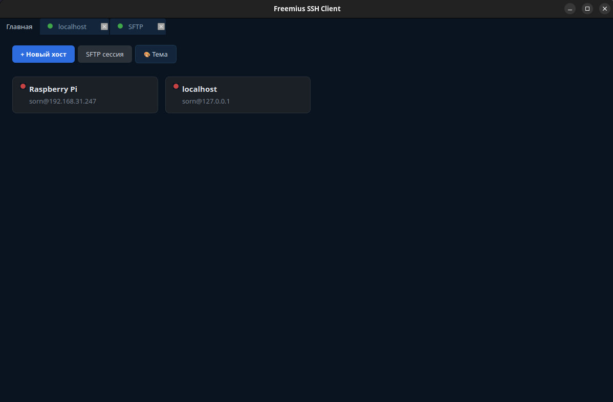

# Freemius

GUI SSH/SFTP клиент для Linux на **PyQt6 + paramiko + pyte**.



## Возможности

- **Многопользовательские SSH-сессии** — каждая в отдельной вкладке
- **Полноценный терминал** — ANSI-цвета, мигающий курсор, копирование/вставка, resize PTY
- **Двухпанельный SFTP** — drag & drop файлов между хостами, прогресс-бар передачи
- **Сохранённые подключения** — плитки хостов на главной вкладке, редактирование, удаление
- **Хранение паролей** — в системном keyring (GNOME Keyring / KWallet / Secret Service), не в открытом виде
- **4 темы** — тёмная, светлая, тёмно-синяя, тёмно-зелёная
- **Горячие клавиши** — `Ctrl+T` (новая сессия), `Ctrl+W` (закрыть вкладку), `Ctrl+Tab` (переключение), `Ctrl+Shift+C/V` (копировать/вставить)
- **Статус вкладки** — зелёный/жёлтый/красный кружок, индикатор активности
- **Localhost из коробки** — предустановленный хост `localhost`

## Установка

### Debian / Ubuntu (`.deb`)

Скачай `.deb` из [последнего релиза](https://github.com/Sornodod/Freemius/releases) и установи:

```bash
sudo apt install ./freemius_*.deb
```

Запуск из меню приложений или командой `freemius`.

Удаление:

```bash
sudo apt remove freemius
```

### AppImage (любой дистрибутив Linux)

Скачай `.AppImage` из [релиза](https://github.com/Sornodod/Freemius/releases), сделай исполняемым и запусти:

```bash
chmod +x freemius-*.AppImage
./freemius-*.AppImage
```

### Из исходников

```bash
git clone https://github.com/Sornodod/Freemius.git
cd Freemius

python3 -m venv venv
source venv/bin/activate.fish   # или venv/bin/activate для bash/zsh
pip install -r requirements.txt

python3 main.py
```

## Системные требования

- Python 3.10+
- Linux (тестировалось на Debian 12 / Ubuntu 22.04+)
- `openssh-client` — для SFTP-панели (используется системный `ssh`/`scp`)
- Secret Service (GNOME Keyring / KWallet) — для сохранения паролей

## Использование

1. На главной вкладке — плитки сохранённых хостов. Клик открывает SSH-сессию.
2. **`+ Новый хост`** — заполни поля, при желании сохрани в список.
3. **`SFTP сессия`** — открывает двухпанельный файловый менеджер: выбери хосты на обеих панелях, копируй файлы drag & drop или кнопками.
4. **`🎨 Тема`** — переключение тем.
5. **ПКМ по плитке** — открыть / редактировать / удалить.

## Хранилище данных

| Что | Где |
|---|---|
| Хосты | `~/.config/freemius/connections.json` (права 600) |
| Настройки (тема) | `~/.config/freemius/settings.json` |
| Пароли | Системный keyring (secret service) |

Пароли **не сохраняются** в `connections.json`.

## Сборка

### AppImage

Требуется `wget` и `libfuse2`:

```bash
sudo apt install wget libfuse2
bash scripts/build_appimage.sh
```

Результат: `dist/freemius-<версия>-x86_64.AppImage`.

### Debian пакет (`.deb`)

```bash
bash scripts/build_deb.sh
```

Результат: `dist/freemius_<версия>_amd64.deb`.

## Разработка

Структура проекта:

```
freemius/
├── app.py              # точка входа, MainWindow
├── config.py           # ConnectionStore, settings, keyring
├── themes.py           # палитры тем + build_stylesheet
├── terminal.py         # TerminalWidget (pyte + QPainter)
├── session_tab.py      # вкладка одной SSH-сессии
├── home_tab.py         # главная вкладка с плитками
├── drawer.py           # выезжающая панель нового подключения
├── sftp_tab.py         # вкладка SFTP (две панели)
├── ui_helpers.py       # общие хелперы (иконки, цвета)
└── sftp/
    ├── panel.py        # FilePanel (стек: выбор хоста → файлы)
    ├── providers.py    # LocalProvider, SCPProvider
    ├── widgets.py      # _HostPicker, _FileView
    └── transfer.py     # передача файлов с прогрессом
```

## Лицензия

MIT — см. [LICENSE](LICENSE).
